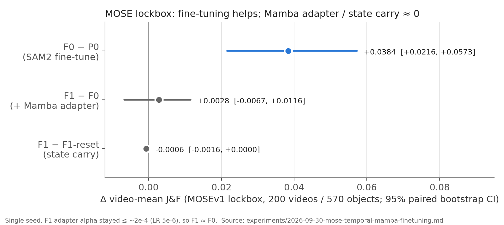
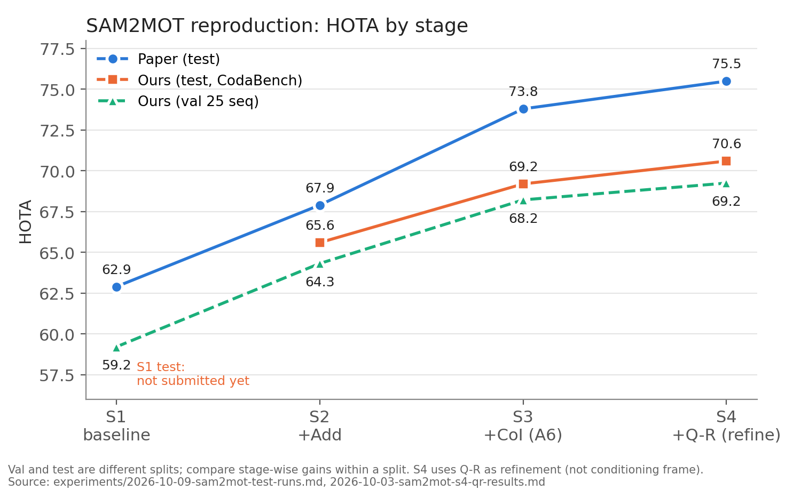

# 2026-10-09 MTG資料: MOSE temporal Mamba結果とSAM2MOT test提出（9/30〜10/9の進捗）

## 0. 今日のMTGで先生に相談したいこと

1. **temporal Mamba（主線）の次の一手**: MOSE追加学習を完走・評価したが、Mamba adapterがLR不足でほぼ学習されておらず、効果を検証できていなかった。次の2案のどちらを先に進めるか。
   - (A) 今の1 token構成のまま、adapter LRと学習量を直して再学習し、「Mambaが学習される状態で効果が出るか」を先に確認する
   - (B) 9/30に話した「空間情報を保つ特徴表現」の設計を先に決め、その構成で再学習する
2. **再評価のデータ**: lockbox 200系列は使用済み。再学習後は「同じ200系列で探索的評価」とするか、「新しいholdoutを切り直す」か。
3. **SAM2MOT（補助線、spec期限10/16）をどこで止めるか**: Q-Rを補正方式にすると3段とも論文と同じ向きになり、test提出も済んだ。S1提出と検出器checkpointの比較で区切るか、CoIでAssAが下がる原因まで掘るか。
4. **中間発表**: 発表日（スライドの表紙は10/18、ファイル名は10/17）と、本日の練習の進め方。MOSEの結果をスライドに入れるか。

## 1. 現時点の結論

- **MOSE**: SAM2全体の追加学習（F0）はJ&Fを+0.038上げた（95% CIは0を含まない）。一方、Mamba追加（F1−F0）とstate carry（F1−F1-reset）の差はほぼ0。ただし事後診断で、**adapterが実質的に学習されていなかった**ことが分かった。「Mambaに効果がない」ではなく「**まだ検証できていない**」と解釈し直している。
- **SAM2MOT**: Q-Rを「conditioning frameとして追加」すると大きく悪化した（val −6.37）が、「補正として入れる」に変えると+1.03になった。DanceTrack testでもS2 65.6 → S3 69.2 → S4 70.6で、**CoIとQ-Rの寄与の向きは論文と一致**した。論文との差は、主にCoIの寄与不足（+3.6 vs +5.9）、その中身はAssAの低下で説明できる。S2の時点でMOTAが約8低いことから、S2以前（検出器・baseline・Add）にも差がある。

## 2. この1週間の進捗（9/30〜10/9）

| 日付 | temporal Mamba / MOSE（主線） | SAM2MOT再現（補助線） | その他 |
|---|---|---|---|
| 9/30 | MOSEv1を取得・展開。F0/F1比較のspecを承認し、pilot（100 step）を実施。本学習の条件を固定し、F0の学習を開始 | S3のA7切り分け（A6のみでHOTA 68.22）。A7を既定で無効に | MTG |
| 10/3 | F0をstep 800から復旧・再開。評価のmanifestとlockbox gate（hashで凍結）を実装 | **S4（Q-R）val: HOTA 61.85（−6.37）** | |
| 10/6 | F0をstep 1400から再開（〜2001） | S4でA7を再確認（A7は無効のまま）。test 35系列の検出生成を完了 | 一次資料調査2本（再現差、test評価構成）。deep-researchスキルを作成 |
| 10/7 | F0 fitが完了。中断対策としてtmux常駐に移行。F1 fitを開始 | **Q-Rのマッチ閾値0.5: HOTA 61.70（変化なし）** | |
| 10/8 | F1 fitが完了。checkpointを選択して凍結し、**lockbox評価を完了**。学習コードをSAM2 repoにcommit | **Q-Rを補正方式に: HOTA 69.25（+1.03）**。test S1〜S4の実行を開始 | 定性比較動画（dancetrack0034）を作成。HOTA 70以上の手法調査のTODOを完了 |
| 10/9 | **事後診断: F1 adapterは実質未学習、F0も学習途中**。成果物の移動とworktreeの削除 | **test S2〜S4をCodaBenchに提出**（S1は提出上限のため10/10以降） | 中間発表スライドをレビュー |

## 3. 9/30 MTGのTODOの対応状況

| 9/30の決定・TODO | 状況 |
|---|---|
| 1 token構成は最小確認用。空間情報を保つ設計候補と根拠を整理する | **未着手**（記録上の進捗なし）。MOSE学習の完走・評価・診断を優先した。10/6に、論文調査の進め方（Deep ResearchとZoteroの使い分け）だけ整理した |
| HOTA 70以上の手法の条件を調べ、SAM2MOT再現と比較する | **完了**（10/6調査、10/8 TODO完了）。結果は5.4節 |
| 中間発表のスライド案を作る | スライド案あり。10/9にレビュー済み（7章） |
| 研究室見学用の資料構成 | 記録上の進捗なし。定性比較動画（10/8）は流用できる |

## 4. Evidence: MOSE temporal Mamba追加学習

### 4.1 設定（承認済みspec）

- SAM2.1 Small、MOSEv1。単一対象、先頭frameのbox promptのみで、後続のGT補正はなし。
- 分割（動画単位、seed 123）: fit 1,121動画 / 2,789軌跡、tuning 125動画 / 313軌跡、lockbox 200動画 / 570軌跡。
- 条件: P0 = 追加学習なし、F0 = SAM2全体を学習、F1 = SAM2全体 + temporal Mamba adapter、F1-reset = F1でMamba stateを毎frame reset（診断用）。
- 学習: fitを1周（2,789 update、batch 1）、TBPTT=8。TBPTT=16は55 frameの系列でOOM（約31 GiB）になったため不採用。peak VRAMは約20.4 GiB。
- tuningの6候補（step 500〜2789）からJ&F最大のcheckpointを選び（F0: 2789、F1: 2000）、コードとcheckpointをhashで凍結してから、lockboxを1回だけ評価した。
- pilot（100 step）の時点でF1−F0 = −0.000003と、差はなかった。

### 4.2 lockbox結果

**この図で見る点**: 追加学習の効果（青）ははっきり出ているが、Mamba追加とstate carryの差（灰）はほぼ0。

| 条件 | J&F |
|---|---:|
| P0 追加学習なし | 0.7008 |
| F0 SAM2全体 | 0.7392 |
| F1 + Mamba | 0.7420 |
| F1-reset | 0.7427 |

| 比較 | ΔJ&F | 95% CI |
|---|---:|---|
| F0 − P0 | +0.0384 | [+0.0216, +0.0573] |
| F1 − F0 | +0.0028 | [−0.0067, +0.0116] |
| F1 − F1-reset | −0.0006 | [−0.0016, +0.0000] |

- 系列長別（短・中・長）でも、F1−F0とF1−F1-resetはすべてCIが0を含む。seedは1つだけ。
- 全条件の予測PNG・frame coverage・凍結hash・集計値を独立に再計算して監査し、不一致は0件。

### 4.3 事後診断（10/9）: adapterは学習されていなかった

adapterの出力は `pix_feat + alpha * residual`（alphaの初期値は0）。

| step | alpha | 出力層 weight norm |
|---:|---:|---:|
| 500 | 1.3e-4 | 9.231 |
| 2000（選択） | 1.9e-4 | 9.231 |
| 2789 | 1.8e-4 | 9.231 |

- 新しく追加したadapterにも、学習済みSAM2を微調整するためのLR（5e-6）を使っていた。cosine減衰で2,789 step回しても、alphaが動ける量は最大で約0.007しかない。
- このため **F1は実質的にF0とほぼ同じモデル** になった。F1−F0とF1−F1-resetがほぼ0という結果は、これと整合する。
- **F0も学習途中**: tuning J&Fは最終stepまで単調に上がっていた。

| step | 500 | 1000 | 1500 | 2000 | 2500 | 2789 |
|---|---:|---:|---:|---:|---:|---:|
| F0 tuning J&F | 0.753 | 0.754 | 0.758 | 0.762 | 0.769 | 0.770 |
| F1 tuning J&F | 0.750 | 0.766 | 0.761 | 0.771 | 0.771 | 0.770 |

- 学習量は公式MOSE configの約1/4（画像フレーム数換算）。ほかにも公式と次の点が異なる: 独自の学習ループ、layer-wise LR decayなし、cosineの終点が0、augmentationの実装順。

### 4.4 運用面で起きたこと

- 学習プロセスが何度か消失した（10/3、10/6、10/7）。tracebackやOOMはなく、エージェントのターン中断に連動していた。毎回、最後の復旧checkpointから再計算して再開し、ログの連番・sample順・lossの有限性を監査して異常はなかった。10/7からはtmuxに常駐させている。
- SAM2MOTの実験とGPUを取り合い、待ちが発生した（S4 val runはOOMで再開）。F0の開始〜完了は168.3時間だが、待ちと中断を含むので実学習時間ではない。

## 5. Evidence: SAM2MOT再現

### 5.1 S4（Q-R）の悪化原因の切り分け（val 25系列）

| S4の設定 | HOTA | AssA | IDF1 | IDSW | Q-R発動回数 | 所要時間 |
|---|---:|---:|---:|---:|---:|---:|
| S3（A6のみ、Q-Rなし） | 68.22 | 64.57 | 75.42 | 839 | — | 2.91 h |
| conditioning frame、マッチIoU>0 | 61.85 | 54.42 | 65.07 | 1,549 | 42,464 | 7.07 h |
| 同上 + A7有効 | 61.24 | 52.91 | 63.49 | 1,377 | — | 6.80 h |
| conditioning frame、マッチIoU>0.5 | 61.70 | 54.31 | 65.07 | 1,461 | 40,602 | 7.18 h |
| **補正として入れる** | **69.25** | 66.31 | 77.23 | 845 | 23,066 | 3.39 h |

- 最初の仮説は「IoU>0のゆるいマッチで、隣の人物のboxでkeyframeを上書きしている」だった（dancetrack0065は衝突0→1,068、HOTA 91→49）。しかし閾値を0.5に絞っても変わらず、この仮説は否定された。
- 原因はA5の操作だった。conditioning frameはSAM2の既定で以降の全フレームから参照されるので、Q-Rが発動するたびにkeyframeが積み重なっていた。補正方式では、崩れていた系列もS3の水準に戻った（0065: 48.7 → 91.1）。
- 論文の "updates the object's keyframe information" を「conditioning frameを追加する」と読んだspecの解釈が外れていた可能性が高い。
- A7はS4の条件でもHOTA・AssA・IDF1を下げたため、無効のまま。

### 5.2 DanceTrack test（CodaBench、10/9提出）

**この図で見る点**: test（橙）とval（緑）で段ごとの伸び方はそろっている。論文（青）との差はS3（CoI）で開く。

| 段 | HOTA | DetA | AssA | MOTA | IDF1 |
|---|---:|---:|---:|---:|---:|
| S2 +Add | 65.6 | 64.0 | 67.3 | 61.3 | 71.9 |
| S3 +CoI | 69.2 | 73.6 | 65.3 | 79.2 | 76.2 |
| S4 +Q-R（補正） | 70.6 | 74.0 | 67.5 | 79.9 | 78.3 |
| 論文 S4 | 75.5 | — | — | 89.2 | 83.4 |

| 寄与 | 本再現 test | 本再現 val | 論文 test |
|---|---:|---:|---:|
| Add ΔHOTA | 未確定（S1未提出） | +5.11 | +5.0 |
| CoI ΔHOTA | +3.6 | +3.90 | +5.9 |
| CoI ΔMOTA | +17.9 | +17.10 | +17.7 |
| CoI ΔAssA | −2.0 | −1.16 | （報告なし） |
| Q-R ΔHOTA | +1.4 | +1.03 | +1.7 |

- test 35系列の4段は、すべて同じコード（commit `cb6ad0e`）、同じ検出、同じGPUで実行し、形式検証はPASS。
- S4の補正方式は、valでの切り分け結果から選んだもの。testで閾値などは調整していない。

### 5.3 論文の数値に届かない理由（これまでの整理）

9/30のMTGでは「特定のトリックが原因とは判断しない。HOTA 70以上の手法の条件と照合する」としていた。その後の一次資料調査（10/6）と実験（10/7〜10/9）で、次のように整理できた。

| 候補 | 根拠 | 現状 |
|---|---|---|
| **CoIの寄与不足（AssAの低下）** | test・valともCoIはAssAを下げる。MOTAの寄与は論文と一致 | **観測済み**。候補はA6の除外範囲と、論文にある「memory frame selection strategy」の未実装 |
| **S2以前の差** | MOTAがS2の時点で論文より8.4低く、S3・S4でもほぼ一定 | 観測済み。baselineとAddのどちらで生じているかは、S1の提出で切り分ける |
| **検出器checkpoint** | 論文本文は「COCO pretrained」、公式READMEはObjects365→COCO（COCO AP 64.1）。本再現は3x_coco（AP 60.0） | 一次資料で確認できた条件差。HOTAへの影響量は未測定 |
| test用の検出閾値CSV | 公式READMEの実行例はtest用の閾値CSVを渡すが、CSVもコードも未公開 | 中身は不明 |
| SAM2 predictorの系統 | 本再現はSAMURAI上流由来。著者が使ったSAM2 commitは不明 | 因果は未確認 |
| Q-Rの最終仕様 | 著者はissueで「最新版ではbox reconstructionを削除した」と回答 | 補正方式で論文と同じ向きにはなった。正しい実装かは不明 |
| 追加学習・追加データ | SAM2MOTはDanceTrackで追加学習しないと明記 | **主因とする根拠なし**（5.4節） |
| ライブラリのversion差 | mmengine 0.10.4 vs 0.10.5 | 影響は小さいと見ている |

公式SAM2MOTのコードは、10/6の時点でも「coming soon」のまま未公開で、公式実装との突き合わせはできない。

### 5.4 HOTA 70以上の手法の条件（10/6調査）

| 手法 | DanceTrack test HOTA | 学習条件 |
|---|---:|---|
| MOTIP | 73.7（SAM2MOTの比較表の値） | DanceTrack train+val + CrowdHumanで学習した強化版。標準の追加データなし版は69.6 |
| ColTrack | 72.6（+valで75.3） | DanceTrack + CrowdHumanで学習 |
| MOTRv2 | 69.9（challenge版は73.4） | YOLOX + CrowdHuman。73.4はval学習 + 4モデルensemble |
| SAM2MOT | 75.5 | DanceTrackでの追加学習なし。強い事前学習済みの検出器とSAM2.1-largeを使用 |

- 70以上の手法は、DanceTrackでの学習やCrowdHuman・val学習などの強化条件を使うものが多く、SAM2MOTとは学習条件が異なる。
- 同じ検出器での比較（SAM2MOT論文のTable 2）ではByteTrack 56.1、OC-SORT 56.2で、SAM2MOTの追跡部分の比較としてはこちらの方が条件がそろっている。

## 6. Interpretation: 解釈

- **MOSE**: 10/8の「主仮説を支持しない」は、「Mambaの効果を有効に検証できていない」へ読み替えるのが妥当（supported）。adapterが性能を下げるため勾配がalphaを0付近へ戻した可能性は完全には否定できないが、出力層の重みもほぼ動いていないので、LR不足が主因と考えている。
- **1 token構成の位置づけ**: 1 token・空間broadcastの構成は、adapterが学習されても効果が出にくい可能性がある（hypothesis）。一方、構成を変えると、「LRを直せば効くのか」と「表現を変えたから効くのか」を切り分けにくくなる。
- **SAM2MOT**: CoIはFPの削減（MOTA）は論文どおり再現できているが、AssAを下げる。メモリ除外が正しいトラックの見失いやIDの付け替わりも起こしている可能性がある（hypothesis）。spec上の機構署名（CoIでAssA増・DetAほぼ不変）は、論文のΔMOTA +17.7自体と両立しにくいため、署名側の見直しが必要。

## 7. 中間発表・研究室見学

### 7.1 スライドのレビュー（10/9）

スライド案 [20261017_中間発表_油谷.pptx](20261017_中間発表_油谷.pptx) の流れは妥当で、12枚目の定量表の値も記録と一致している。主な修正点:

- 11枚目: 学習・評価条件を具体化する（DanceTrack trainのGT bboxでMambaのみを学習、評価はval 25系列・SAM2-tiny・TrackEval、GT bbox promptで初期化）。
- 13枚目: 定性動画の「ID 9」はtracker IDではなく比較対象のラベル。見出しを「この例ではGTに近いbboxを維持」程度に絞る。
- 14枚目: 「誤対応が入力・stateへ影響する構造上のリスク（未検証）」と明記する。
- 15〜16枚目: 「提案手法2」→「現在の研究方向」「挿入位置の検討」とし、「最小接続の検証段階、最適性は未検証」と注記する。
- 17枚目: 「SAMURAIに対しHOTA等が小幅に向上、IDSWは減少せず」と書き、今後の作業を1行加える。
- 細かい点: 3枚目のTransTrackの出典の誤り、15枚目の「追放後」→「追跡後」、表紙の日付。

詳細は [中間発表スライドのレビュー](2026-10-09-midterm-slide-review.md)。

### 7.2 定性比較動画（10/8）

dancetrack0034のframe 300〜340（41 frame、10 fps）で、SAM2 / SAMURAI / Mamba-stateの3本を作成した。GT ID 9に対してIoUが最大の予測boxを表示している（tracker IDの継続を示すものではない）。中間発表の13枚目と研究室見学に使える。→ [動画の表示条件](../experiments/figures/2026-10-08-dancetrack0034-frames300-340-qualitative.md)

## 8. 今回言えること / まだ言えないこと

| 言えること | まだ言えないこと |
|---|---|
| MOSE追加学習でSAM2のJ&Fは上がる（単一seed） | temporal Mambaに効果がある / ない |
| 現行F1ではadapterがほぼ学習されていなかった | state carryがVOSに役立つか |
| F0の学習量は足りていない（最終stepまで上昇） | 学習量を増やしたときの到達点 |
| Q-Rは補正として入れれば、val・testとも論文と同じ向きに効く | 論文の「keyframe更新」の正しい実装 |
| testでもCoIの寄与は論文より小さく、AssAを下げる | CoIのAssA低下の原因 |
| MOTAの差はS2以前で生じている | 検出器checkpointの差が何ポイント効くか、Addの寄与と順序基準（S1未提出） |
| SAM2MOTの75.5は追加学習なしの数値と明記されている | 公式実装との一致（コードが未公開） |

## 9. 方針候補・比較（temporal Mamba）

| | (A) LRを直して1 tokenで再学習 | (B) 空間表現を先に設計 |
|---|---|---|
| 確かめられること | adapterが学習される条件で効果が出るか | 最終構成に近い形での効果 |
| 利点 | 原因を切り分けやすい。コード変更が小さい | 9/30の方針と一致。最終設計に直結 |
| 懸念 | 1 tokenでは効果が出にくい可能性 | 設計と計算量の調査が先に必要。効果がない場合の原因が分かりにくい |
| 共通で必要 | adapter用のLR分離、alpha初期化の見直し、短いpilotでalphaの更新を確認、F0の学習量の増加、新しいspecとImplementation Gate | 同左 |

たたき台（資料作成時の案、要確認）: まず少数軌跡のpilotで「adapterが学習されること」だけを短時間で確認し（A寄り）、本学習は(B)の設計を決めてから行う。

学習量を増やすとF0/F1とも数日規模になる（今回のF1 fitは約17時間、F0は中断込みで1週間）。SAM2MOTとのGPU配分も合わせて決めたい。

## 10. 次に進む候補

- MOSE再学習のspec作成（adapter LR、alpha初期化、学習量、公式trainerに寄せるか、評価データ）。pilotでalphaと出力層の更新を確認してから本学習に進む。
- temporal Mambaの空間表現: 空間トークンをそのまま入れる場合の計算量・メモリを測り、関連研究と合わせて設計候補を整理する。
- SAM2MOT（期限10/16）: S1を提出（10/10以降）→ Addの寄与と順序基準を判定。必要なら検出器checkpoint（o365tococo）をvalで比較する。
- 中間発表スライドの修正、研究室見学の資料構成。

## 11. 参照ファイル

- [MOSE追加学習の実験ログ（pilot・本学習・closeout・事後診断）](../experiments/2026-09-30-mose-temporal-mamba-finetuning.md)
- [MOSE追加学習spec](../specs/2026-09-30-temporal-mamba-mose-finetuning-spec.md)
- [MOSE学習範囲の検討（brainstorm）](../../../../secretary/notes/brainstorm/2026-09-30-temporal-mamba-adapter-training.md)
- [MOSEのMTG向けログ提示方針（brainstorm）](../../../../secretary/notes/brainstorm/2026-10-08-mose-mtg-logging-strategy.md)
- [SAM2MOT S4・Q-Rの切り分け](../experiments/2026-10-03-sam2mot-s4-qr-results.md)
- [SAM2MOT test提出結果](../experiments/2026-10-09-sam2mot-test-runs.md)
- [SAM2MOT S3 A7切り分け](../experiments/2026-09-30-sam2mot-s3-a7-ablation.md)
- [SAM2MOT再現差の一次資料調査](../papers/2026-10-06-deep-research-sam2mot-reproduction-gap.md)
- [DanceTrack test評価構成の調査](../papers/2026-10-06-deep-research-dancetrack-test-evaluation-configurations.md)
- [SAM2MOT性能差の調査方針（brainstorm）](../../../../secretary/notes/brainstorm/2026-10-06-sam2mot-performance-gap-investigation.md)
- [論文調査の運用（brainstorm）](../../../../secretary/notes/brainstorm/2026-10-06-literature-research-workflow.md)
- [中間発表スライドのレビュー](2026-10-09-midterm-slide-review.md)
- [定性比較動画](../experiments/figures/2026-10-08-dancetrack0034-frames300-340-qualitative.md)
- [9/30 議事録](../meetings/2026-09-30-mtg.md)
- 図の生成元: 上記実験ログの数値から作成（[manifest](figures/2026-10-09-weekly-progress/manifest.md)）
